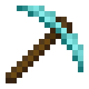
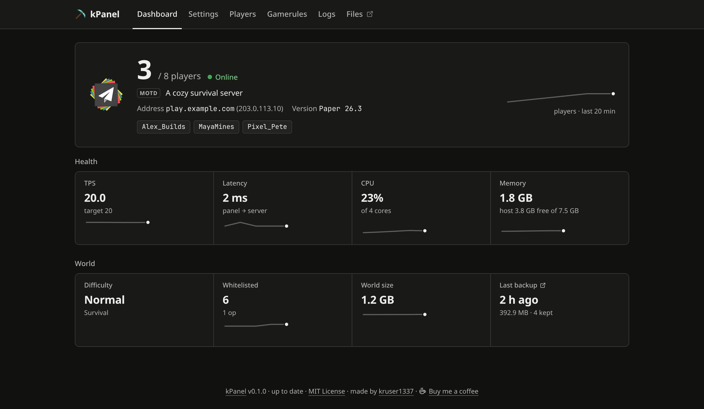
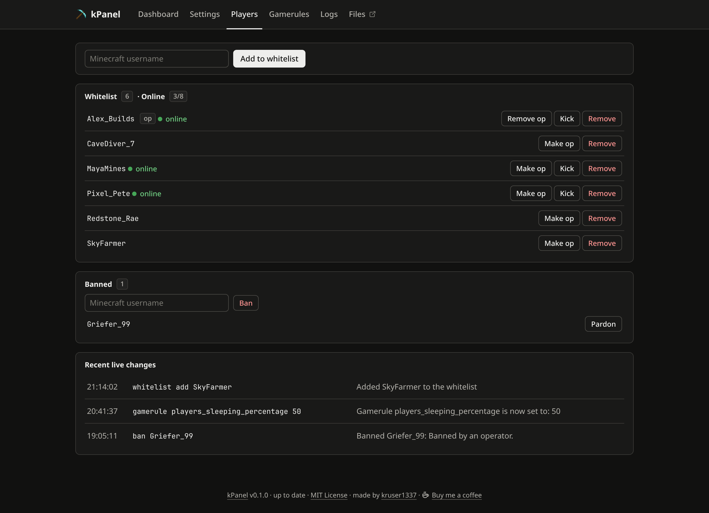
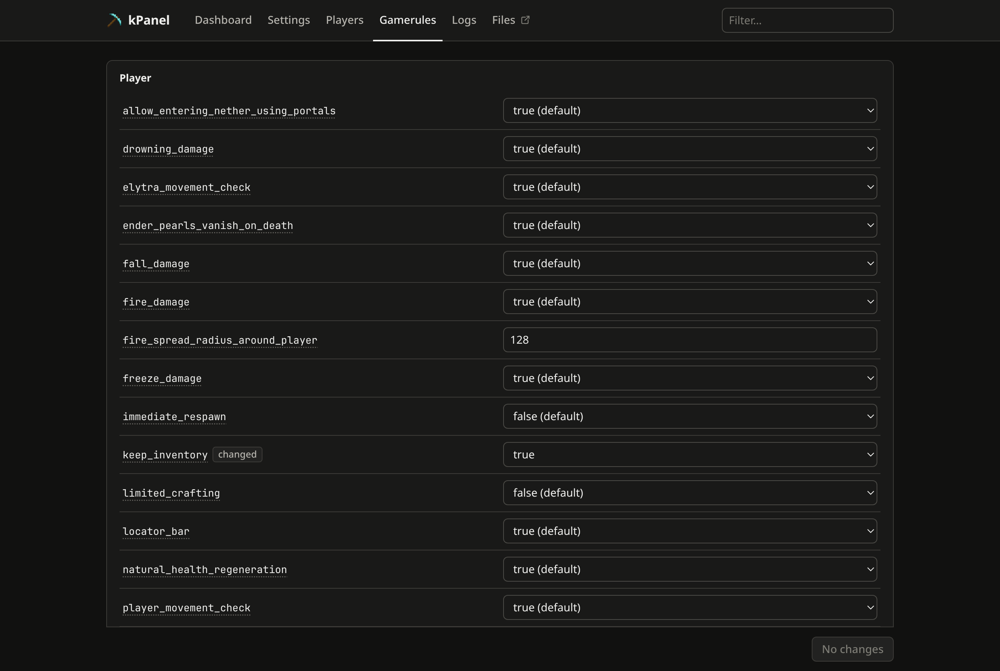
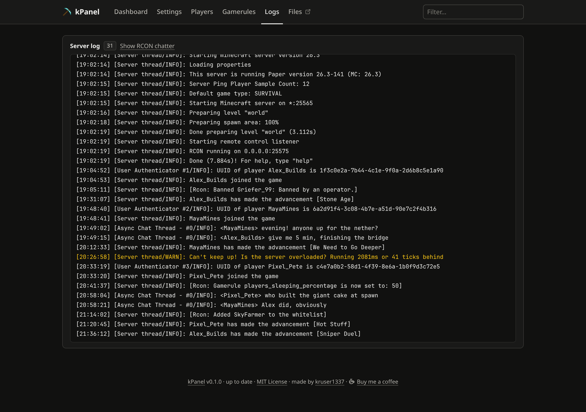
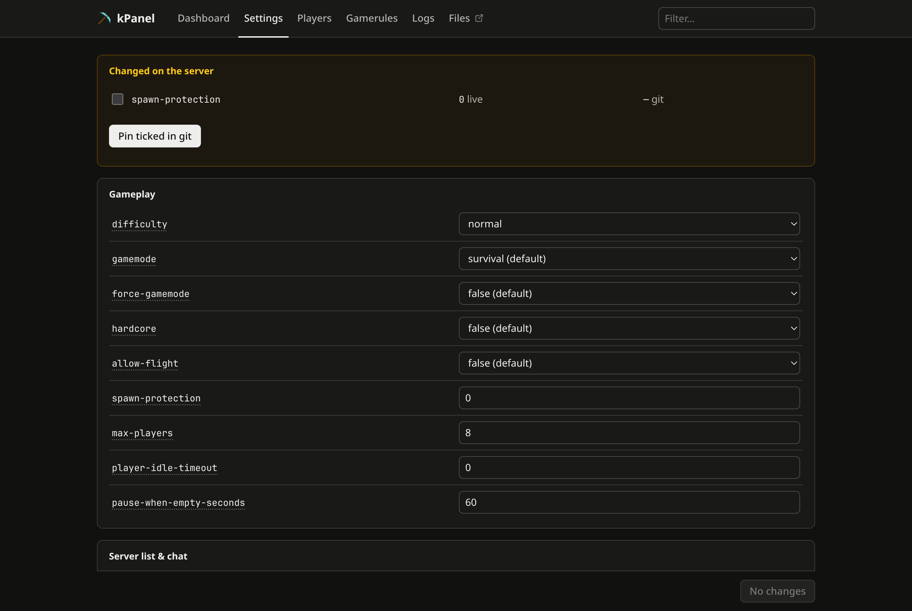

#  kPanel

[](https://github.com/kruser1337/kPanel/actions/workflows/tests.yml)
[](https://github.com/kruser1337/kPanel/releases/latest)
[](LICENSE)
[](https://buymeacoffee.com/kruser1337)

A self-hosted Minecraft server with a web admin panel, as one `docker compose`
stack. A Paper server, scheduled backups, a file manager, and a panel for the
day-to-day: who's online, whitelist and bans, gamerules, every
`server.properties` key, and the server log.

Built for running a server for yourself and a few friends — not a hosting
business. No multi-tenancy, no database, no user accounts.



## What the panel does

| Page | What you get |
|---|---|
| **Dashboard** | Online/offline, players, MOTD and icon, TPS, latency, CPU, memory, world size, newest backup — refreshed every 30 s |
| **Players** | Whitelist add/remove, op/deop, kick, ban/pardon. Live over RCON: no restart |
| **Gamerules** | All 58 gamerules, grouped and explained. Applied immediately |
| **Logs** | The server log in a terminal pane, searchable, with the RCON polling noise hidden |
| **Settings** | Every `server.properties` key with explanations, saved to the file; restart from the panel to apply |

<table>
  <tr>
    <td width="50%"></td>
    <td width="50%"></td>
  </tr>
  <tr>
    <td></td>
    <td></td>
  </tr>
</table>

<sub>Screenshots use made-up data.</sub>

## Why not Crafty or Pterodactyl?

Use them if you run many servers or host for other people.
[Pterodactyl](https://pterodactyl.io) is a panel plus a daemon on every machine,
built for hosting fleets; [Crafty Controller](https://craftycontrol.com) manages
many servers with user accounts. kPanel is for one server you run for yourself
and friends: one `docker compose up -d`, no database or accounts to set up, the
panel never gets the Docker socket, and every setting is explained in place.

## Quickstart

You need Docker with Compose 2.24 or newer. Then:

```bash
git clone https://github.com/kruser1337/kPanel && cd kPanel
docker compose up -d
```

That's all. No `.env`, no accounts:

- **The panel** is at <http://localhost:8080>
- **The file manager** is at <http://localhost:8081>
- **Players** connect to this machine on port **25565**

The whitelist is on, so before anyone can join, add them (yourself first) on
the panel's **Players** page.

The panel and file manager open **on this machine only**, so they need no login.
To reach them from somewhere else, add one of the optional overlays below.

**Updating:** `git pull && docker compose up -d --build`. The panel's footer
tells you when a new release is out; see
[Upgrading](docs/operations.md#upgrading).

## Optional extras

| You want | Add | Needs |
|---|---|---|
| The panel from other devices on your network | `-f compose/lan.yml` | `KPANEL_BASIC_AUTH` and `FILES_PASSWORD` in `.env` |
| The panel from anywhere, over HTTPS | `-f compose/tailscale.yml` | A Tailscale account; see [`docs/tailscale.md`](docs/tailscale.md) |
| Settings changes as reviewed pull requests | nothing extra | A fork of this repo and a GitHub token; see [Settings](#settings) |
| Deploys on every merge | Coolify | See [`docs/coolify.md`](docs/coolify.md) |

Overlays are added after the base file, e.g.

```bash
cp .env.example .env    # uncomment and fill in the lines you need
docker compose -f docker-compose.yml -f compose/lan.yml up -d
```

**Passwords are enforced, not suggested.** `compose/lan.yml` publishes the panel
and the file manager to your network, so compose refuses to start until both
passwords are set, and the panel itself refuses to run without a login. A panel
exposed by accident looks exactly like one that is working, so it must not be
possible to get one by forgetting a line.

## Settings

Settings writes `server.properties` directly. Change values, **Save**, then
**Restart now**: Minecraft reads the file only at startup.

If you'd rather keep settings in git, fork this repository and set
`KPANEL_GITHUB_REPO` and `KPANEL_GITHUB_TOKEN` in `.env` (see
[`.env.example`](.env.example)). Settings then opens a pull request against
your fork's `docker-compose.yml` instead of writing the file, so every change
is reviewed and kept in history.

## Server types

Built and tested on Paper. Other types the image supports (`TYPE: "FABRIC"`,
`"VANILLA"`, `"PURPUR"`, …) are untested so far, so
[reports are welcome](https://github.com/kruser1337/kPanel/issues). The panel
only uses RCON, the server-list ping and the files in `/data`; drop
`PAPER_BUILD` when you switch. The TPS tile needs the `tps` command of Paper, Purpur and Spigot, so on
Fabric and vanilla it shows `—`. Choose before the first start: Paper keeps the
Nether and End in separate folders, so an existing world needs moving first.

## Newer Minecraft versions

The compose pins the newest Minecraft version that has a **stable** Paper
build. When a new version is out, Paper publishes beta (experimental) builds
first. You can run one, but it's your call:

- **Betas can have bugs that damage a world.** Take a backup first.
- **There's no way back.** A newer version migrates the world on load, and it
  can't be opened with an older one again. Going back means restoring a backup.
- **Plugins** may not support the new version yet.

To opt in, set `VERSION` and `PAPER_BUILD` to the beta and add
`PAPER_CHANNEL: "experimental"`. See [Upgrading](docs/operations.md#upgrading).

## What's in the stack

| Container | Job |
|---|---|
| `mc` | Paper server ([`itzg/minecraft-server`](https://github.com/itzg/docker-minecraft-server)) |
| `mc-backup` | Scheduled world backups, pruned to a fixed count |
| `kpanel` | The panel. Python standard library plus PyYAML; no database |
| `filebrowser` | [FileBrowser Quantum](https://github.com/gtsteffaniak/filebrowser) over the world files |
| `tailscale` | *Only with `compose/tailscale.yml`:* puts the panel and file manager on your tailnet |

The panel writes only `server.properties` and talks to the server over RCON. It
deliberately has **no access to the Docker socket** — that would expose every
other container's environment on the host.

## Status

Running a real server daily, and still young — expect rough edges. Issues and
pull requests are very welcome, as are "this was confusing" reports, which are
usually the most useful kind.

Day-to-day running (backups, restores, upgrades, troubleshooting) is in
[`docs/operations.md`](docs/operations.md).

## Licence

MIT; see [`LICENSE`](LICENSE).

`kpanel/favicon.png` is separate: the diamond pickaxe from Minetest Game by
BlockMen, under **CC BY-SA 3.0** — attribution in
[`kpanel/favicon.LICENSE.txt`](kpanel/favicon.LICENSE.txt). The MIT licence
covers the code, not that image.
`.github/pickaxe.png`, the icon next to the title, is the same image enlarged
8× with nearest-neighbour scaling and otherwise unchanged; it is under the same
CC BY-SA 3.0 licence.

The panel's colours ([Radix Colors](https://github.com/radix-ui/colors)) and
icons ([Tabler Icons](https://github.com/tabler/tabler-icons)) are MIT too,
with their notices in [`kpanel/ui.LICENSE.txt`](kpanel/ui.LICENSE.txt).

## Support

kPanel is free and MIT licensed. If it saves you some time, you can
[buy me a coffee](https://buymeacoffee.com/kruser1337).
